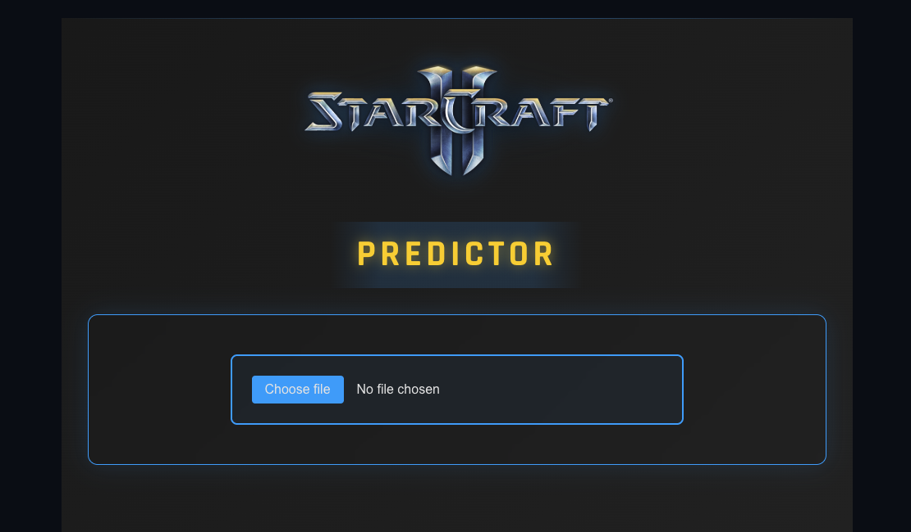
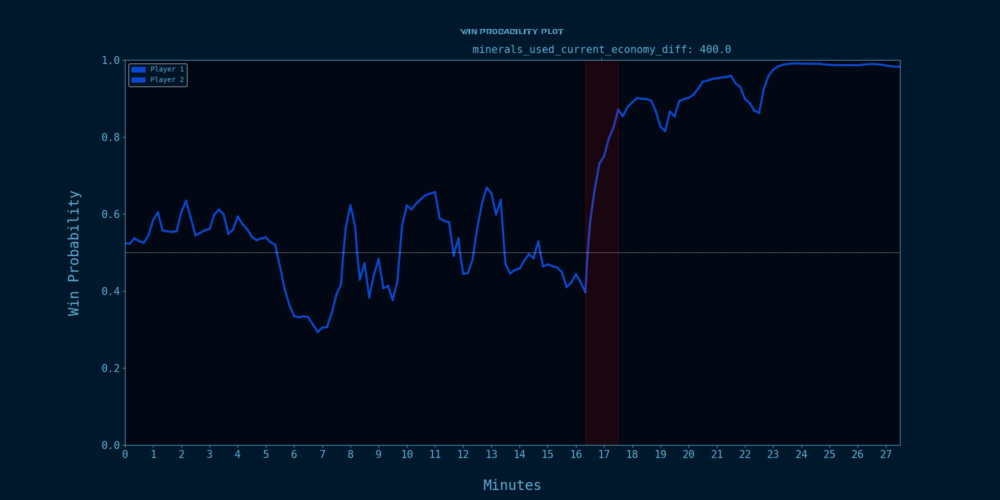

# starcraft_predictor
`starcraft_predictor` contains a pre-trained ML model that can be used to generate win probabilities throughout a Starcraft 2 game. The package uses `.SC2Replay` files to load in game metadata and generate predictions based on the state of the game at every 10 second interval.

## Running the project

The project code lives in the `src/starcraft_predictor` folder, and is served as a webapp via a FastAPI backend and a React frontend. Full disclosure, the frontend was built entirely by Cursor, I don't understand anything in React...

To run the project, first start the FastAPI backend with:

```
make run_backend
```

This will deploy the FastAPI to `localhost:8000`, you can check the API docs [here](localhost:8000/docs).

Next you'll need to trigger the frontend. To do this, you'll need to have [npm and node.js installed](https://docs.npmjs.com/downloading-and-installing-node-js-and-npm). Then run the following:

```
make run_frontend
```

This will deploy the frontend app to `localhost:5173`, where you will see something like the following!



You can then upload your own SC2Replay files to see the prediction for your own games!

