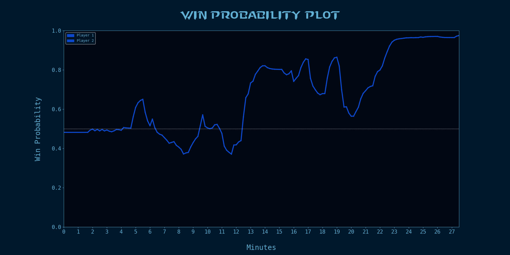

# starcraft_predictor
`starcraft_predictor` contains a pre-trained XGBoost model that can be used to generate win probabilities throughout a Starcraft 2 game. The package uses `.SC2Replay` files to load in game metadata and generate predictions based on the state of the game at every 10 second interval.


## Setup
The package is not currently on PyPi so the best way to use it locally is to clone the repo

```
git clone https://github.com/nedwebster/starcraft_predictor.git
```

Then navigate into the directory and run 

```
pip install .
```

## Usage

To analyse a replay, use the `api` module from `starcraft_predictor`.

Run the following code in a notebook:

```
from starcraft_predictor import api

api.evaluate_replay("path/to/replay.SC2Replay")
```




## Further Documentation

For documentation on usage for any other aspects of the package, there are example notebooks in the `example_noteboks` folder.


## Folder Structure
```
.
├── example_data/                        <-- example data to use in the tutorials 
├── example_notebooks/                   <-- notebook tutorials for app functionality
├── ml_analysis/                         <-- adhoc analysis that guides parts of the ML project
├── pre_trained_model/                   <-- all code for retraining the pre-trained model
├── (preprocessing, scoring, etc) 
└── starcraft_predictor/                 <-- main app folder/
    ├── modelling/                       <-- code relating to the ml model (preprocessing, scoring, etc)/
    │   ├── __init__.py
    │   ├── custom_transformers.py       <-- transformers to generate features from raw data
    │   ├── model_params.py              <-- params for model training (hyperparameters, features)
    │   ├── model.py                     <-- wrapper for pre-trained model, including custom predict method
    │   └── pipeline.py                  <-- full pre-processing pipeline for transforming raw data
    ├── __init__.py                    
    ├── plot_engine.py                   <-- all code relating to the win probability plots
    ├── replay_engine.py                 <-- code for processing a replay object into a usable csv
    ├── replay.py                        <-- class representing the sc2 replay
    └── scp_api.py                       <-- main user api for the package
```

## Testing
The package uses `pytest` as it's testing framework. It also uses the `pytest-mpl` addon for testing plots (documentation can be found here: https://github.com/matplotlib/pytest-mpl).

Baseline plots have been created for `pytest-mpl` with the command:
```pytest --mpl-generate-path=tests/baseline```
This command does not need to be re-run by the user, unless changes are made that alter the output of the plots.

To run the tests locally, use the following command:

```pytest --mpl tests/.```

## TODO
- Additional feature to model
- Explore alternative modelling techniques
- Key moments overlay on plots
- Conformal predictors for assessing model confidence