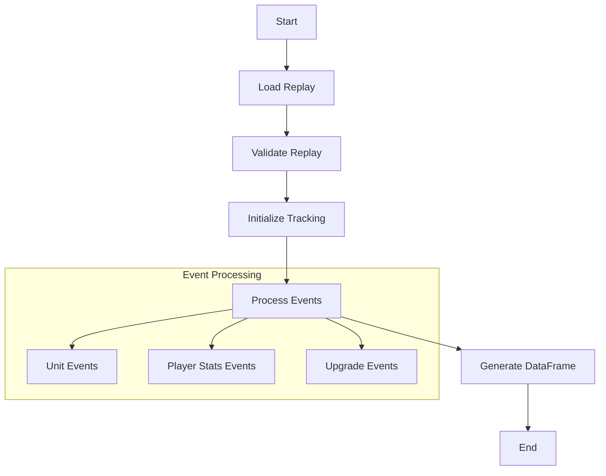
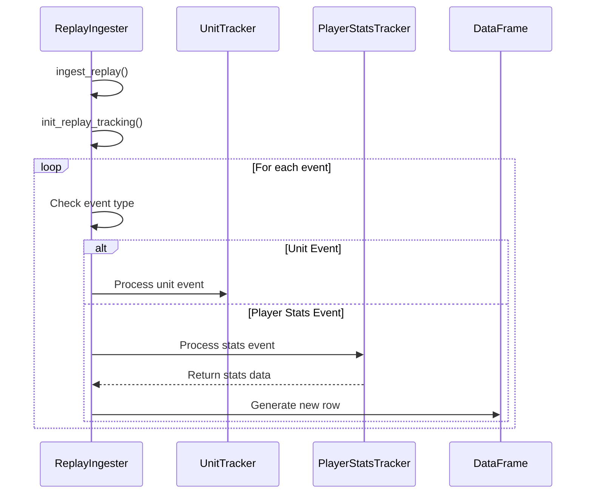
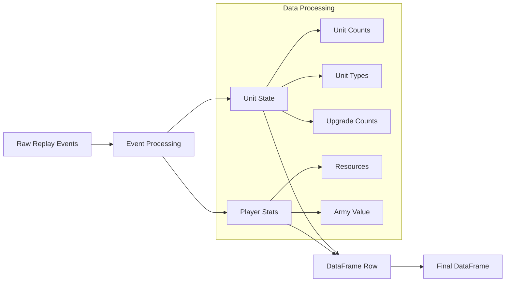

# Replay Ingestion

Replay ingestion plays an important part in the repo, as it is what extract features from the replay, converting the SC2Replay file into a tabular form that can be analysed, processed, and eventually fed into a machine learning model. The SC2Replay files follow and event structure, where each 'action' that happens in game is represented by an event. The general approach to ingesting the replays is to ingest the events one by one, building up a picture of the game in the form of rows in a pandas dataframe. The diagrams below show this in great detail. All replay ingestion code can be found in the `src/starcraft_predictor/replays/` folder.

## Process Flow

This diagram illustrates the main workflow of the replay ingestion process. It shows how a replay file moves through the system from initial loading to final DataFrame generation. The process begins with loading the replay file, followed by validation to ensure it matches the expected matchup type. The system then initializes tracking components for units and player stats. The core of the process is the event processing stage, which handles three main types of events: unit events (birth, death, type changes), player stats events (collected every 10 seconds), and upgrade events. Finally, the processed data is compiled into a DataFrame that represents the game state at regular intervals.

## Sequence Diagram

This sequence diagram demonstrates the temporal flow of event processing in the system. It shows how events are handled sequentially, with the ReplayIngester acting as the coordinator. The process begins with replay ingestion and initialization. Then, for each event in the replay, the system checks the event type and routes it to the appropriate handler. Unit events are processed by the UnitTracker, while player stats events trigger the PlayerStatsTracker and result in new rows being added to the DataFrame. This diagram emphasizes the event-driven nature of the system and how different components interact over time.

## Data Transformation Flow

This diagram illustrates how raw replay data is transformed into a structured DataFrame. It shows the parallel processing of unit state and player statistics, which are then combined into individual DataFrame rows. The unit state includes information about unit counts and types, while player stats track resources and army value. These different data streams are merged to create a comprehensive view of the game state at each time interval. The final DataFrame contains all this information in a format suitable for analysis and prediction.

